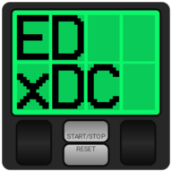

  

    
    
    
    
    
    

  

# Elite Dangerous E*x*ternal Display Controller

Seamlessly reads Elite Dangerous journal data and presents real-time system, planet, cargo, and other information on your Saitek/Logitech X52 Pro Multi-Function Display.

> [!IMPORTANT] 
> _This software only works with the Saitek/Logitech X52 Pro. The standard X52 HOTAS does not support third-party software for the MFD._

※_Development is ongoing. See the [changelog](https://github.com/pellux-network/EDxDC/blob/master/CHANGELOG.md) for details on recent fixes and features._

## Getting Started

To install EDxDC, you have two options:

1. **Installer (Recommended):**  
   Download and run the latest `EDxDC-vX.X.X-[ReleaseType]-Setup.exe` from the [Releases](https://github.com/pellux-network/EDxDC/releases/latest) page. This will install the application and create shortcuts for easy access.

2. **Portable:**  
   Alternatively, download the latest `EDxDC-vX.X.X-[ReleaseType]-portable-amd64.zip` from the [Releases](https://github.com/pellux-network/EDxDC/releases/latest) page. Unzip it into a location of your choosing such as `C:\Games\`. Then run the included `.exe` directly.

If you haven't modified Elite Dangerous' journal path and don't want to disable any pages, simply run the app and your MFD should immediately begin loading.

If your journal file location is different than the default or you wish to disable any pages, check the [Configuration](https://github.com/pellux-network/EDxDC/wiki/3.-Configuration) page on the [Wiki](https://github.com/pellux-network/EDxDC/wiki) for more details.

> [!TIP] 
> _It is recommended to run a tool that uploads data to the Elite Dangerous Data Network, such as [ED Market Connector](https://github.com/Marginal/EDMarketConnector). Doing this will ensure that any new discoveries can be shown on the display._

## [Wiki](https://github.com/pellux-network/EDxDC/wiki)

For additional information or help with any encountered issues, visit the [Wiki](https://github.com/pellux-network/EDxDC/wiki). This includes info on getting the correct drivers for the X52

## Credits

- Huge thanks to [pbxx](https://github.com/pbxx) for icons, page layouts, and huge general improvements to the codebase as well as helping clean up the original code.

## Attribution

- This software was originally based off of [EDx52display](https://github.com/peterbn/EDx52display) by [Peter Pakkenberg](https://github.com/peterbn)

  <a href="#EDxDC">Jump to top</a>

